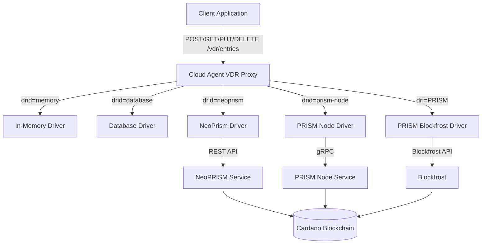
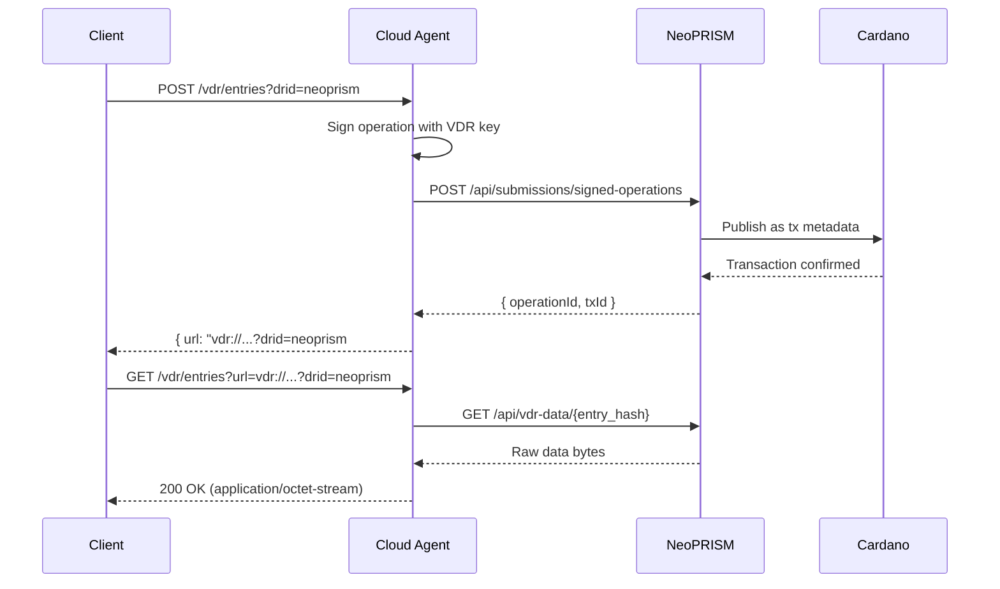

# VDR Interface

## Overview

VDR is an interface for performing CRUD and verification operations on a generic data storage driver.
The specification is available [here](https://github.com/hyperledger-identus/vdr),
along with a reference implementation provided as a library.
The interface defines simple create, read, update, delete, and verify operations, delegating
their execution to an underlying driver. Driver is an actual implementation of a data storage mechanism.

## HTTP Binding

Although the VDR implementation is available as a library, it is also integrated into the Cloud Agent
to expose its functionality via HTTP, supporting use cases where direct library integration is not feasible.

The Cloud Agent exposes the VDR functionality through a RESTful style API,
providing an interface analogous to direct method calls.

__Example__

| Operation | HTTP Endpoint |
|-|-|
| `create(data, options)`      | `POST /vdr/entries?drid=...`  |
| `read(url, options)`         | `GET /vdr/entries?url=...`    |
| `update(url, data, options)` | `PUT /vdr/entries?url=...`    |
| `delete(url, options)`       | `DELETE /vdr/entries?url=...` |

## Selecting VDR Drivers

The driver is a key component of VDR, providing the actual implementation for the storage backend.
The cloud agent acts as a proxy, supporting multiple drivers and allowing users to choose the one that best fits their needs.
To select the appropriate driver, specify the following parameters when creating a VDR entry.

| Parameters | Description |
|-|-|
| `drid` | Driver ID      |
| `drf`  | Driver family  |
| `drv`  | Driver version |

For a full range of parameters and driver options, please refer to the [VDR specification](https://github.com/hyperledger-identus/vdr).

## Architecture

The Cloud Agent acts as a VDR proxy, supporting multiple drivers simultaneously. The driver to use is selected via request parameters (`drid`, `drf`, `drv`), allowing users to choose the appropriate backend for each operation.



## Available Drivers

The Cloud Agent supports multiple VDR drivers for different use cases:

| Driver | ID | Family | Version | Description | Use Case |
|--------|----|----|---------|-------------|----------|
| In-memory | `memory` | `memory` | `0.1.0` | Ephemeral in-memory storage | Testing, non-persistent data |
| Database | `database` | `database` | `0.1.0` | Local database storage | Development, testing |
| NeoPrism | `neoprism` | `neoprism` | `1.0.0` | Cardano blockchain via NeoPRISM REST API | **Recommended** for production |
| PRISM Node | `prism-node` | `prism-node` | `1.0.0` | Cardano blockchain via PRISM Node gRPC | Legacy production deployments |
| PRISM (Blockfrost) | `PRISMDriverInMemory` | `PRISM` | `1.0` | Cardano blockchain via Blockfrost | Direct blockchain access |

### Driver Configuration

**Memory Driver**: Enable with `VDR_MEMORY_DRIVER_ENABLED=true`. No additional configuration required.

**Database Driver**: Enable with `VDR_DATABASE_DRIVER_ENABLED=true`. Uses the Cloud Agent's existing database configuration.

**NeoPrism Driver**: Enable with `VDR_NEOPRISM_DRIVER_ENABLED=true`. Requires a running NeoPRISM instance and `NEOPRISM_BASE_URL`. See the [NeoPrism Driver](#neoprism-driver) section below.

**PRISM Node Driver**: Enable with `VDR_PRISM_NODE_DRIVER_ENABLED=true`. Requires a running PRISM Node instance. See the [PRISM Node Driver](#prism-node-driver) section below.

**PRISM (Blockfrost) Driver**: See the [PRISM Driver](#prism-driver) section below.

For all VDR environment variables, see the [Environment Variables](./environment-variables.md) documentation.

**Choosing a driver**:
- **Development/Testing**: Use `memory` or `database` drivers for fast iteration without blockchain overhead
- **Blockchain-backed storage (recommended)**: Use `neoprism` driver with NeoPRISM for modern REST-based integration
- **Blockchain-backed storage (legacy)**: Use `prism-node` driver for existing PRISM Node deployments
- **Direct blockchain access**: Use `PRISM` driver for Blockfrost-based access without an intermediary node

## NeoPrism Driver

### Overview

The NeoPrism driver stores VDR entries on the Cardano blockchain through a [NeoPRISM](/documentation/learn/advanced-explainers/neoprism/) instance. This is the **recommended** blockchain-backed VDR driver for new deployments, offering a modern REST API, lightweight resource usage, and full VDR lifecycle management.

The Cloud Agent communicates with NeoPRISM via HTTP to:
- Submit signed VDR operations (create, update, deactivate) to the Cardano blockchain
- Resolve VDR entry data and metadata
- Query operation status

### How It Works

VDR entries are cryptographically bound to a `did:prism` DID. The Cloud Agent signs each VDR operation with the DID's VDR key, then submits the signed operation to NeoPRISM for blockchain anchoring.



The `entry_hash` (SHA-256 of the inner PRISM operation) is deterministic — the Cloud Agent computes it locally without waiting for blockchain confirmation.

### Prerequisites

1. **NeoPRISM instance** running in standalone mode (see [Running NeoPRISM](/documentation/learn/advanced-explainers/neoprism/running-neoprism))
2. **Active DID with VDR key** — the Cloud Agent's managed DID must have a VDR key (`KeyUsage::VDR_KEY`)
3. **NeoPRISM base URL** configured via `NEOPRISM_BASE_URL`

### Configuration

| Variable | Required? | Description | Default |
|----------|-----------|-------------|---------|
| `VDR_NEOPRISM_DRIVER_ENABLED` | ✅ Yes | Enable the NeoPrism VDR driver | `false` |
| `NEOPRISM_BASE_URL` | ✅ Yes | Base URL of the NeoPRISM service | `http://localhost:8080` |
| `VDR_DEFAULT_KEY_ID` | No | Default VDR key ID to use for signing | `vdr-1` |

### Configuration Example

```bash
VDR_NEOPRISM_DRIVER_ENABLED=true
NEOPRISM_BASE_URL=http://neoprism:8080
VDR_DEFAULT_KEY_ID=vdr-1
```

:::tip
Any application holding the VDR private key can manage VDR entries directly through the NeoPRISM REST API — the Cloud Agent is not the only client. See the [NeoPRISM VDR documentation](https://github.com/hyperledger-identus/neoprism) for the direct API usage.
:::

## PRISM Node Driver

### Overview

The PRISM Node driver stores VDR entries on the Cardano blockchain through a [PRISM Node](/documentation/learn/advanced-explainers/prism-node/) instance using gRPC. This is the legacy blockchain-backed VDR driver, supported for existing deployments.

:::warning
PRISM Node is considered a legacy implementation. For new deployments, use the [NeoPrism Driver](#neoprism-driver) instead.
:::

### Configuration

| Variable | Required? | Description | Default |
|----------|-----------|-------------|---------|
| `VDR_PRISM_NODE_DRIVER_ENABLED` | ✅ Yes | Enable the PRISM Node VDR driver | `false` |
| `PRISM_NODE_HOST` | ✅ Yes | Hostname of the PRISM Node | `localhost` |
| `PRISM_NODE_PORT` | ✅ Yes | Port of the PRISM Node gRPC service | `50053` |
| `PRISM_NODE_USE_PLAIN_TEXT` | No | Use plaintext gRPC (no TLS) | `true` |
| `VDR_DEFAULT_KEY_ID` | No | Default VDR key ID to use for signing | `vdr-1` |

### Configuration Example

```bash
VDR_PRISM_NODE_DRIVER_ENABLED=true
PRISM_NODE_HOST=prism-node
PRISM_NODE_PORT=50053
PRISM_NODE_USE_PLAIN_TEXT=true
VDR_DEFAULT_KEY_ID=vdr-1
```

## PRISM Driver

### Overview

The PRISM driver stores data on the Cardano blockchain, providing decentralized, permanent, and verifiable storage. Unlike the in-memory and database drivers which store data locally for testing, the PRISM driver offers blockchain-backed guarantees suitable for deployments requiring blockchain permanence.

**Key capabilities**:
- Data stored on Cardano blockchain, not controlled by any single entity
- Permanent, immutable storage that persists beyond agent lifecycle
- Publicly verifiable by anyone with blockchain access
- Designed for scenarios requiring blockchain auditability

**Best suited for**:
- Deployments requiring public, decentralized verification
- Credential status lists that must remain accessible indefinitely
- Use cases with regulatory requirements for tamper-proof storage

**For development**: Use the in-memory or database drivers for faster iteration without blockchain transaction costs and delays.

### Prerequisites

Before enabling the PRISM driver, ensure you have:

1. **Active PRISM DID**: A `did:prism:` identifier with an active VDR key
2. **Cardano Wallet**: A wallet mnemonic phrase (24 words) for blockchain transactions
3. **VDR Private Key**: A Secp256k1 private key (in hexadecimal format) of an active VDR key of the DID
4. **Blockfrost Access**: Either:
   - A Blockfrost API key for public networks (mainnet, preprod, preview), OR
   - A private Blockfrost instance URL and protocol magic number
5. **State Directory**: A filesystem directory with read/write permissions for the indexed VDR state

### Configuration

Configure the PRISM driver using these environment variables:

#### Core Configuration

| Variable | Required? | Description | Example/Default |
|----------|-----------|-------------|-----------------|
| `VDR_PRISM_DRIVER_ENABLED` | ✅ Yes | Enable the PRISM VDR driver | `true` |
| `VDR_PRISM_DRIVER_DID_PRISM` | ✅ Yes | DID that owns the data (must have active VDR key) | `did:prism:abc123...` |
| `VDR_PRISM_DRIVER_VDR_PRIVATE_KEY` | ✅ Yes | VDR private key in hexadecimal format | `a1b2c3d4e5f6...` |
| `VDR_PRISM_DRIVER_WALLET_MNEMONIC` | ✅ Yes | Wallet mnemonic phrase (space-separated, 24 words) | `word1 word2 ... word24` |
| `VDR_PRISM_DRIVER_VDR_STATE_DIR` | ✅ Yes | Directory path for indexer state storage | `/var/lib/cloud-agent/vdr-state` |

#### Network Configuration (choose ONE)

| Variable | Required? | Description | Example/Default |
|----------|-----------|-------------|-----------------|
| `VDR_PRISM_DRIVER_BLOCKFROST_API_KEY` | Option A | Your Blockfrost API key (mainnet/preprod/preview) | `mainnetABC123...` |
| `VDR_PRISM_DRIVER_PRIVATE_NETWORK_URL` | Option B | URL of private Blockfrost instance | `http://localhost:18082` |
| `VDR_PRISM_DRIVER_PRIVATE_NETWORK_PROTOCOL_MAGIC` | Option B | Protocol magic number for private network | `42` |

**⚠️ Network Configuration**: You MUST configure exactly ONE network option:
- **Option A** (Public Blockfrost): Set `VDR_PRISM_DRIVER_BLOCKFROST_API_KEY` only
- **Option B** (Private Network): Set both `VDR_PRISM_DRIVER_PRIVATE_NETWORK_URL` and `VDR_PRISM_DRIVER_PRIVATE_NETWORK_PROTOCOL_MAGIC`

The Cloud Agent will reject configurations that set both options simultaneously.

#### Optional Configuration

| Variable | Required? | Description | Example/Default |
|----------|-----------|-------------|-----------------|
| `VDR_PRISM_DRIVER_INDEX_INTERVAL_SECOND` | No | Blockchain polling interval (seconds) | `60` (default) |

### Configuration Examples

#### Example 1: Public Blockfrost (Mainnet)

This example shows a mainnet configuration using Blockfrost's mainnet service:

```bash
export VDR_PRISM_DRIVER_ENABLED=true
export VDR_PRISM_DRIVER_BLOCKFROST_API_KEY="mainnetABC123YourKeyHere"
export VDR_PRISM_DRIVER_DID_PRISM="did:prism:4a5b6c7d8e9f0a1b2c3d4e5f6a7b8c9d0e1f2a3b4c5d6e7f8a9b0c1d2e3f4a5b"
export VDR_PRISM_DRIVER_VDR_PRIVATE_KEY="a1b2c3d4e5f6a7b8c9d0e1f2a3b4c5d6e7f8a9b0c1d2e3f4a5b6c7d8e9f0a1b2"
export VDR_PRISM_DRIVER_WALLET_MNEMONIC="word1 word2 word3 word4 word5 word6 word7 word8 word9 word10 word11 word12 word13 word14 word15 word16 word17 word18 word19 word20 word21 word22 word23 word24"
export VDR_PRISM_DRIVER_VDR_STATE_DIR="/var/lib/cloud-agent/vdr-state"
export VDR_PRISM_DRIVER_INDEX_INTERVAL_SECOND=60
```

#### Example 2: Private Network

This example shows a configuration for a private or local Cardano network:

```bash
export VDR_PRISM_DRIVER_ENABLED=true
export VDR_PRISM_DRIVER_PRIVATE_NETWORK_URL="http://localhost:18082"
export VDR_PRISM_DRIVER_PRIVATE_NETWORK_PROTOCOL_MAGIC=42
export VDR_PRISM_DRIVER_DID_PRISM="did:prism:4a5b6c7d8e9f0a1b2c3d4e5f6a7b8c9d0e1f2a3b4c5d6e7f8a9b0c1d2e3f4a5b"
export VDR_PRISM_DRIVER_VDR_PRIVATE_KEY="a1b2c3d4e5f6a7b8c9d0e1f2a3b4c5d6e7f8a9b0c1d2e3f4a5b6c7d8e9f0a1b2"
export VDR_PRISM_DRIVER_WALLET_MNEMONIC="word1 word2 word3 word4 word5 word6 word7 word8 word9 word10 word11 word12 word13 word14 word15 word16 word17 word18 word19 word20 word21 word22 word23 word24"
export VDR_PRISM_DRIVER_VDR_STATE_DIR="/var/lib/cloud-agent/vdr-state"
```

### Driver Variants

**⚠️ Cloud Agent Users**: The Cloud Agent is configured to use `PRISMDriverInMemory` ONLY. This is the sole PRISM driver implementation available via the Cloud Agent's HTTP API.

The underlying [PRISM VDR driver library](https://github.com/hyperledger-identus/prism-vdr-driver) provides three implementations with different storage backends:

#### 1. PRISMDriverInMemory ✅ Available in Cloud Agent

- **Storage**: In-memory state with chunk file persistence
- **Use case**: Standard Cloud Agent deployment, balances performance with persistence
- **Configuration**: Via environment variables documented in the [Configuration](#configuration) section above
- **State management**: Loads blockchain state from chunk files in the configured state directory
- **Source code**: [PRISMDriverInMemory.scala](https://github.com/hyperledger-identus/prism-vdr-driver/blob/main/src/main/scala/hyperledger/identus/vdr/prism/PRISMDriverInMemory.scala), [PrismDriver.scala](https://github.com/hyperledger-identus/prism-vdr-driver/blob/main/src/main/scala/hyperledger/identus/vdr/prism/PrismDriver.scala)

#### 2. PRISMDriverMongoDB ❌ Library Integration Only

- **Storage**: MongoDB (read-only)
- **Use case**: Applications requiring shared, scalable state storage across multiple instances
- **Requires**: Direct Scala library integration, external MongoDB setup and indexing
- **NOT available**: Cannot be used via Cloud Agent's HTTP API
- **Source code**: [PRISMDriverMongoDB.scala](https://github.com/hyperledger-identus/prism-vdr-driver/blob/main/src/main/scala/hyperledger/identus/vdr/prism/PRISMDriverMongoDB.scala)

#### 3. PRISMDriverMongoDBWithIndexer ❌ Library Integration Only

- **Storage**: MongoDB with built-in indexing capability
- **Use case**: Applications that need to manage their own blockchain indexing process
- **Requires**: Direct Scala library integration, external MongoDB setup
- **NOT available**: Cannot be used via Cloud Agent's HTTP API
- **Source code**: [PRISMDriverMongoDBWithIndexer.scala](https://github.com/hyperledger-identus/prism-vdr-driver/blob/main/src/main/scala/hyperledger/identus/vdr/prism/PRISMDriverMongoDBWithIndexer.scala)

#### Comparison Table

| Implementation | Storage Backend | Cloud Agent | Library Integration |
|----------------|-----------------|-------------|---------------------|
| PRISMDriverInMemory | In-memory + chunk files | ✅ Available | ✅ Available |
| PRISMDriverMongoDB | MongoDB (read-only) | ❌ Not available | ✅ Available |
| PRISMDriverMongoDBWithIndexer | MongoDB + indexing | ❌ Not available | ✅ Available |

All implementations share the same protocol parameters:
- **Driver Family**: `PRISM`
- **Driver Version**: `1.0`

**For Cloud Agent users**: Use the environment variables documented above. The `PRISMDriverInMemory` implementation is automatically configured when you enable the PRISM driver.

**For library integrators**: If you need MongoDB-backed storage, you must integrate the PRISM VDR driver library directly into your Scala application. Refer to the driver source code and library documentation for integration details.

### Important Considerations

**Security**: Store your wallet mnemonic and VDR private key securely. Never commit these values to version control or expose them in logs. Consider using secret management solutions like HashiCorp Vault in operational environments.

**State Directory**: Ensure the state directory has appropriate permissions and sufficient disk space. The indexer will create required subdirectories automatically on first run.

**Blockchain Data Permanence**: Data stored on the blockchain is permanent and cannot be truly deleted. The VDR `DELETE` operation marks entries as deactivated but does not remove them from the blockchain. Plan your data lifecycle accordingly and avoid storing sensitive information that may need to be removed.

**Transaction Costs**: Writing data to the Cardano blockchain incurs transaction fees paid from your configured wallet. Ensure the wallet has sufficient ADA balance for your expected operations.

**Indexing Delay**: Changes to the blockchain may take time to be reflected in the driver's state, depending on the configured polling interval and blockchain confirmation times. Consider these delays when designing time-sensitive workflows.
