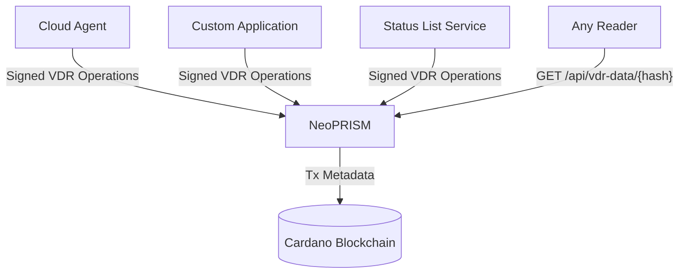

# NeoPRISM

## Overview

[NeoPRISM](https://github.com/hyperledger-identus/neoprism) is an open-source alternative implementation of a PRISM Node for managing PRISM [Decentralized Identifiers (DIDs)](/home/concepts/glossary#decentralized-identifier) anchored on the Cardano blockchain. Written in Rust, NeoPRISM provides a lightweight, resource-efficient solution for DID resolution, indexing, and operation submission capabilities for the `did:prism` method.

NeoPRISM offers an alternative to the legacy PRISM Node, focusing on ease of deployment, efficient resource usage, and reliable performance. It integrates seamlessly with the [Cloud Agent](/home/concepts/glossary#cloud-agent) as a configurable DID node backend.

## Key Features

NeoPRISM provides the following capabilities:

- **Multiple Deployment Modes**: Supports Indexer, Submitter, and Standalone modes for flexible deployment scenarios
- **Cardano Integration**: Works with Oura and DBSync data sources for blockchain synchronization
- **W3C-Compliant**: Provides Universal Resolver-compatible HTTP endpoints for DID resolution
- **Operation Publishing**: Submits DID operations to the Cardano blockchain
- **VDR Support**: Implements [Verifiable Data Registry](/home/concepts/glossary#verifiable-data-registry) functionality with arbitrary data storage
- **Resource Efficient**: Rust implementation optimized for performance and low resource consumption
- **Docker Ready**: Official Docker images with multi-architecture support (x86_64, arm64)
- **Database Flexibility**: Supports both PostgreSQL and SQLite backends

## Verifiable Data Registry (VDR)

NeoPRISM implements a Verifiable Data Registry (VDR) that enables storing, updating, and deactivating arbitrary data entries anchored to the Cardano blockchain. VDR entries are cryptographically bound to a `did:prism` DID — each operation must be signed by the DID's VDR key.

### VDR Operations

| Operation | Description |
|-----------|-------------|
| **CreateStorageEntry** | Stores new data (raw bytes, IPFS CID, or StatusListEntry) and returns a unique entry hash |
| **UpdateStorageEntry** | Replaces the data of an existing entry; requires the `previous_event_hash` for optimistic concurrency |
| **DeactivateStorageEntry** | Marks an entry as deactivated; subsequent resolution returns 404 |

### VDR REST API

| Endpoint | Method | Description |
|----------|--------|-------------|
| `/api/vdr-data/{entry_hash}` | GET | Resolve VDR entry data (returns raw bytes) |
| `/api/vdr-entries/{entry_hash}` | GET | Get VDR entry metadata (entry_hash, latest_event_hash, status) |

### Integration with Cloud Agent

When used as the [Cloud Agent's VDR backend](/documentation/develop/cloud-agent/vdr#neoprism-driver), NeoPRISM handles the blockchain anchoring of VDR entries. The Cloud Agent signs operations with the DID's VDR key and submits them to NeoPRISM via REST API.

### Direct API Usage

Any application holding the VDR private key can manage VDR entries directly through the NeoPRISM API, without requiring the Cloud Agent. This enables use cases where multiple independent applications manage VDR entries for the same DID:

For detailed API usage, see the [NeoPRISM repository](https://github.com/hyperledger-identus/neoprism).

## NeoPRISM Deployment mode

NeoPRISM supports multiple deployment modes to accommodate different architectural needs:

#### Indexer Mode

The Indexer mode synchronizes with the Cardano blockchain, processes DID operations from blocks, and maintains the current state of DIDs in the database. This mode only performs read operations from the blockchain.

#### Submitter Mode

The Submitter mode handles the submission of signed DID operations to the Cardano blockchain. It manages the transaction lifecycle and tracks operation status until confirmation.

#### Standalone Mode

The Standalone mode combines both Indexer and Submitter functionality into a single service, providing complete DID management capabilities.

#### Dev Mode

The Dev mode provides a simplified setup for local development and testing, using an in-memory SQLite database and an in-memory blockchain with minimal configuration.
